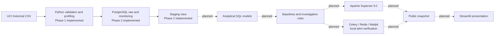

# EnergyOps architecture

Phase 1 implements local source intake, provenance, validation, profiling and tests. Phase 2 adds a local PostgreSQL 16 service, typed raw loading with rejection/audit tables, and a staging view. Downstream nodes are planned only.

Phase 1 stores the original CSV in a Git-ignored local path and emits a checked-in aggregate JSON profile. Phase 2 checks its checksum, streams typed readings into `raw`, retains rejected rows and audit runs, and exposes a nonmaterialized staging view. `analytics` exists but is empty. Analytical models and rules will require separate documented eligibility before dashboards or alerts are built. The eventual public snapshot must be a historical presentation, not a live operational feed.
