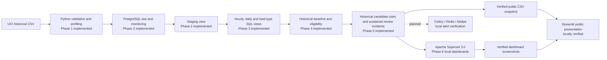

# EnergyOps architecture

Phase 1 implements local source intake, provenance, validation, profiling and tests. Phase 2 adds a local PostgreSQL 16 service, typed raw loading with rejection/audit tables, and a staging view. Phase 3 adds six read-only analytical views for historical energy summaries. Phase 4 adds historical baseline components and hour-level eligibility views. Phase 5 adds historical candidate rule evaluation and sustained review incidents. Phase 6 adds a local Apache Superset 3.0 service with persistent metadata, a restricted analytics login and three verified dashboards. The public presentation phase exports a verified, versioned snapshot and runs Streamlit from committed files without runtime database access.

Phase 1 stores the original CSV in a Git-ignored local path and emits a checked-in aggregate JSON profile. Phase 2 checks its checksum, streams typed readings into `raw`, retains rejected rows and audit runs, and exposes a nonmaterialized staging view. Phase 3 adds nonmaterialized views with exact hourly, daily, load-type and time-of-day grains; see [SQL_MODELS.md](SQL_MODELS.md). Phase 4 compares current load-type components only with strictly earlier comparable intervals and records whether each observed hour is eligible; see [BASELINE_AND_ELIGIBILITY.md](BASELINE_AND_ELIGIBILITY.md). Phase 5 evaluates two fixed rules on eligible hours and groups consecutive positive hours independently per rule; see [INVESTIGATION_RULES.md](INVESTIGATION_RULES.md). Phase 6 registers 11 view-backed datasets and 28 charts in separate local Superset metadata storage; see [SUPERSET.md](SUPERSET.md). The public Streamlit layer consumes six compressed, view-backed tables and static Superset captures; see [PUBLIC_PRESENTATION.md](PUBLIC_PRESENTATION.md). Candidate incidents are historical review groups, not equipment events or delivered alerts. Local scheduled EnergyOps alert delivery is planned.
