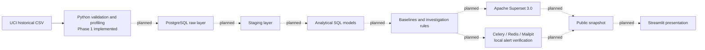

# EnergyOps architecture

Only local source intake, provenance, validation, profiling, tests and documentation are implemented in Phase 1. The remaining nodes show design intent and have no running service or model in this repository.

Phase 1 stores the original CSV in a Git-ignored local path and emits a checked-in aggregate JSON profile. `source_validation.py` defines the exact schema and quality checks. The raw future layer should preserve source values and identity. Staging should apply explicit mappings and quarantine violations. Analytical models and rules will require separate documented eligibility and reconciliation before dashboards or alerts are built. The eventual public snapshot must be a historical presentation, not a live operational feed.
